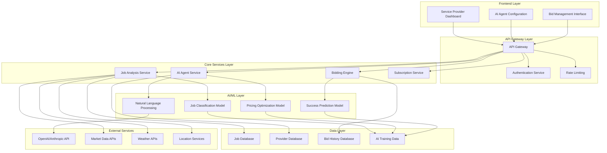
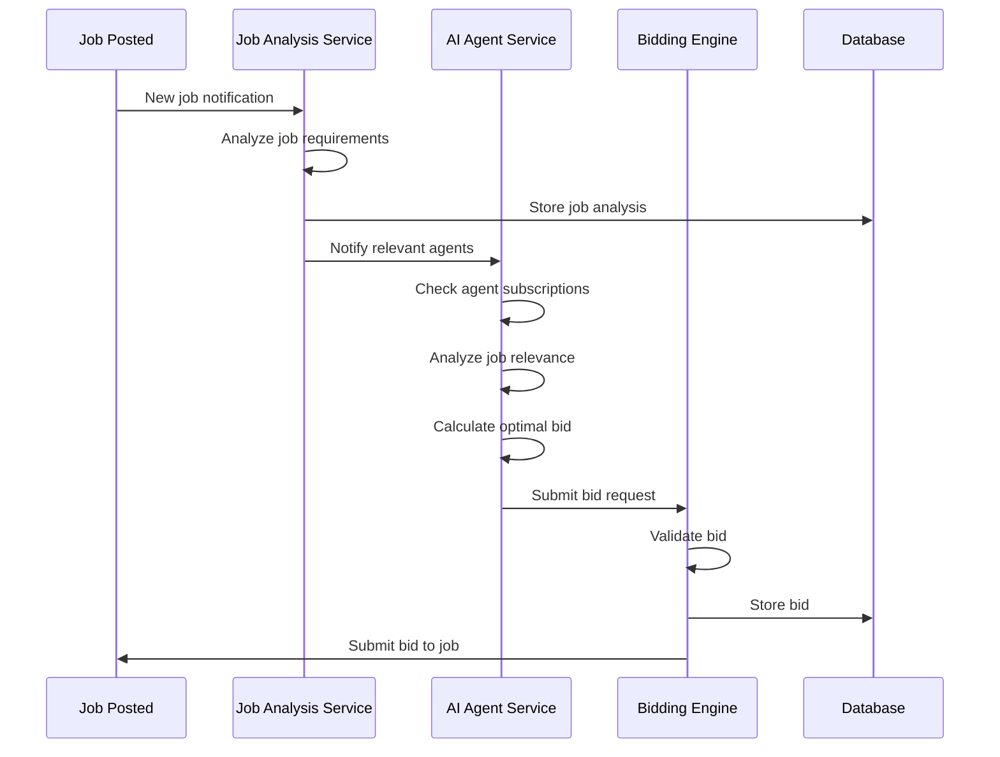
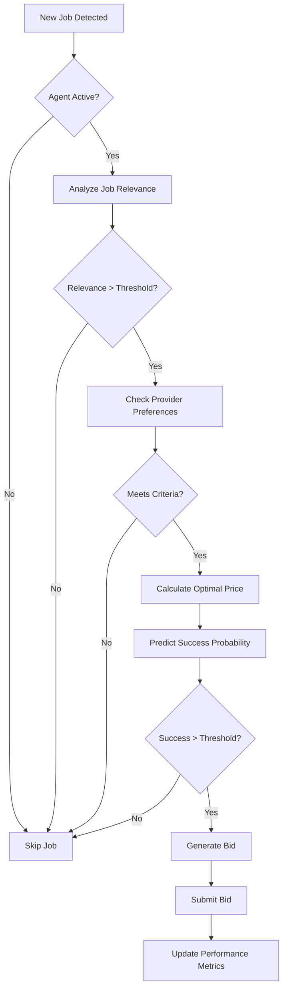

# Agentic AI Bidding System Architecture Blueprint

## Overview
The Agentic AI Bidding System is an intelligent automation platform that enables service providers to subscribe to AI agents that can automatically analyze, evaluate, and bid on relevant jobs on their behalf. This system uses advanced AI models, real-time data processing, and intelligent decision-making algorithms to maximize bid success rates while maintaining quality and profitability.

## 🏗️ System Architecture

### High-Level Architecture


## 🔧 Core Components

### 1. AI Agent Service
**Purpose**: Central orchestration of AI agents for each service provider

**Technology Stack**:
- **Language**: Python 3.11+
- **Framework**: FastAPI
- **AI Models**: OpenAI GPT-4, Anthropic Claude, Local LLMs (Ollama)
- **Vector Database**: Pinecone/Weaviate for embeddings
- **Message Queue**: Redis/RabbitMQ for async processing

**Key Features**:
- Multi-model AI agent management
- Real-time job monitoring and analysis
- Intelligent bidding decision making
- Learning from historical bid performance
- Provider preference learning and adaptation

### 2. Job Analysis Service
**Purpose**: Analyze incoming jobs and determine relevance for AI agents

**Technology Stack**:
- **Language**: Python 3.11+
- **ML Framework**: scikit-learn, TensorFlow/PyTorch
- **NLP**: spaCy, NLTK, Transformers
- **Data Processing**: Pandas, NumPy
- **Caching**: Redis for real-time analysis

**Key Features**:
- Job classification and categorization
- Skill requirement extraction
- Location and travel time analysis
- Urgency and timeline assessment
- Market demand analysis

### 3. Bidding Engine
**Purpose**: Execute intelligent bidding strategies based on AI analysis

**Technology Stack**:
- **Language**: Node.js/TypeScript
- **Framework**: Express.js
- **Database**: MongoDB with Redis caching
- **Queue System**: Bull Queue for job processing
- **Monitoring**: Prometheus + Grafana

**Key Features**:
- Dynamic pricing algorithms
- Competitive analysis
- Success probability calculation
- Bid timing optimization
- Risk assessment and mitigation

### 4. Subscription Service
**Purpose**: Manage AI agent subscriptions and billing

**Technology Stack**:
- **Language**: Node.js/TypeScript
- **Framework**: Express.js
- **Database**: MongoDB
- **Payment**: Stripe for subscription billing
- **Notifications**: SendGrid for email alerts

**Key Features**:
- Subscription tier management
- Usage tracking and billing
- Feature access control
- Performance analytics
- Provider onboarding

## 🧠 AI/ML Models

### 1. Job Classification Model
**Purpose**: Categorize jobs and match with provider capabilities

**Model Architecture**:
```python
class JobClassifier:
    def __init__(self):
        self.bert_model = AutoModel.from_pretrained('bert-base-uncased')
        self.classifier = MLPClassifier(hidden_layers=[512, 256, 128])
        self.vectorizer = TfidfVectorizer(max_features=10000)
    
    def classify_job(self, job_description, location, budget):
        # Extract features
        features = self.extract_features(job_description, location, budget)
        
        # Classify service type
        service_type = self.classifier.predict(features)
        
        # Calculate confidence score
        confidence = self.classifier.predict_proba(features).max()
        
        return {
            'service_type': service_type,
            'confidence': confidence,
            'subcategories': self.get_subcategories(service_type)
        }
```

### 2. Pricing Optimization Model
**Purpose**: Determine optimal bid amounts based on market conditions

**Model Architecture**:
```python
class PricingOptimizer:
    def __init__(self):
        self.market_model = RandomForestRegressor(n_estimators=100)
        self.competition_model = GradientBoostingRegressor()
        self.profit_model = LinearRegression()
    
    def calculate_optimal_price(self, job_data, provider_profile, market_conditions):
        # Market analysis
        market_price = self.market_model.predict(job_data)
        
        # Competition analysis
        competition_factor = self.competition_model.predict(job_data)
        
        # Profit optimization
        profit_margin = self.profit_model.predict(provider_profile)
        
        # Calculate final price
        optimal_price = self.optimize_price(
            market_price, competition_factor, profit_margin
        )
        
        return {
            'suggested_price': optimal_price,
            'confidence': self.calculate_confidence(job_data),
            'reasoning': self.generate_reasoning(job_data, optimal_price)
        }
```

### 3. Success Prediction Model
**Purpose**: Predict likelihood of bid acceptance

**Model Architecture**:
```python
class SuccessPredictor:
    def __init__(self):
        self.feature_encoder = LabelEncoder()
        self.success_model = XGBoostClassifier()
        self.timing_model = LSTM(input_dim=50, hidden_dim=100)
    
    def predict_success(self, bid_data, job_data, provider_data):
        # Feature engineering
        features = self.engineer_features(bid_data, job_data, provider_data)
        
        # Success prediction
        success_probability = self.success_model.predict_proba(features)[0][1]
        
        # Timing optimization
        optimal_timing = self.timing_model.predict(features)
        
        return {
            'success_probability': success_probability,
            'optimal_timing': optimal_timing,
            'key_factors': self.identify_key_factors(features)
        }
```

## 📊 Data Architecture

### 1. Data Models

#### AI Agent Configuration
```typescript
interface AIAgentConfig {
  _id: string;
  providerId: string;
  subscriptionTier: 'basic' | 'premium' | 'enterprise';
  isActive: boolean;
  preferences: {
    serviceTypes: string[];
    maxBidAmount: number;
    minProfitMargin: number;
    preferredLocations: GeoLocation[];
    workingHours: TimeRange[];
    maxTravelDistance: number;
  };
  aiSettings: {
    model: 'gpt-4' | 'claude-3' | 'local-llama';
    temperature: number;
    maxTokens: number;
    customPrompts: Record<string, string>;
  };
  performanceMetrics: {
    totalBids: number;
    successfulBids: number;
    averageResponseTime: number;
    profitGenerated: number;
    lastActive: Date;
  };
  createdAt: Date;
  updatedAt: Date;
}
```

#### Bid Analysis
```typescript
interface BidAnalysis {
  _id: string;
  jobId: string;
  agentId: string;
  analysis: {
    relevanceScore: number;
    skillMatch: number;
    locationScore: number;
    urgencyScore: number;
    marketDemand: number;
    competitionLevel: number;
  };
  pricing: {
    suggestedAmount: number;
    confidence: number;
    reasoning: string;
    marketComparison: {
      average: number;
      median: number;
      range: [number, number];
    };
  };
  successPrediction: {
    probability: number;
    keyFactors: string[];
    recommendations: string[];
  };
  createdAt: Date;
}
```

### 2. Database Schema

#### MongoDB Collections
```javascript
// AI Agents Collection
db.ai_agents.createIndex({ "providerId": 1, "isActive": 1 });
db.ai_agents.createIndex({ "subscriptionTier": 1 });
db.ai_agents.createIndex({ "preferences.serviceTypes": 1 });

// Bid Analyses Collection
db.bid_analyses.createIndex({ "jobId": 1, "agentId": 1 });
db.bid_analyses.createIndex({ "analysis.relevanceScore": -1 });
db.bid_analyses.createIndex({ "createdAt": -1 });

// AI Training Data Collection
db.ai_training_data.createIndex({ "jobType": 1, "outcome": 1 });
db.ai_training_data.createIndex({ "createdAt": -1 });
```

## 🔄 System Workflow

### 1. Job Processing Pipeline


### 2. AI Agent Decision Process


## 🚀 Implementation Phases

### Phase 1: Foundation (Weeks 1-4)
- **AI Agent Service Setup**
  - Basic agent configuration
  - Simple job analysis
  - Manual bid submission
  - Provider subscription management

### Phase 2: Intelligence (Weeks 5-8)
- **ML Model Development**
  - Job classification model
  - Basic pricing optimization
  - Success prediction model
  - Performance tracking

### Phase 3: Automation (Weeks 9-12)
- **Full Automation**
  - Real-time job monitoring
  - Automatic bid submission
  - Learning from feedback
  - Advanced analytics

### Phase 4: Optimization (Weeks 13-16)
- **Advanced Features**
  - Multi-model AI support
  - Advanced pricing strategies
  - Market trend analysis
  - Predictive analytics

## 🔧 Technical Implementation

### 1. AI Agent Service (Python/FastAPI)
```python
# main.py
from fastapi import FastAPI, BackgroundTasks
from ai_agent_service import AIAgentService
from job_analyzer import JobAnalyzer
from bidding_engine import BiddingEngine

app = FastAPI()
ai_service = AIAgentService()
job_analyzer = JobAnalyzer()
bidding_engine = BiddingEngine()

@app.post("/ai/analyze-job")
async def analyze_job(job_data: dict, background_tasks: BackgroundTasks):
    # Analyze job for all active agents
    analysis = job_analyzer.analyze(job_data)
    
    # Queue for AI agent processing
    background_tasks.add_task(ai_service.process_job, job_data, analysis)
    
    return {"status": "queued", "analysis_id": analysis.id}

@app.post("/ai/agent/{agent_id}/bid")
async def submit_bid(agent_id: str, bid_data: dict):
    # Submit bid on behalf of agent
    result = bidding_engine.submit_bid(agent_id, bid_data)
    return result
```

### 2. Job Analysis Service (Python)
```python
# job_analyzer.py
import pandas as pd
from sklearn.feature_extraction.text import TfidfVectorizer
from sklearn.ensemble import RandomForestClassifier
import spacy

class JobAnalyzer:
    def __init__(self):
        self.nlp = spacy.load("en_core_web_sm")
        self.vectorizer = TfidfVectorizer(max_features=10000)
        self.classifier = RandomForestClassifier(n_estimators=100)
        self.load_models()
    
    def analyze(self, job_data):
        # Extract features
        features = self.extract_features(job_data)
        
        # Classify job
        classification = self.classify_job(features)
        
        # Analyze requirements
        requirements = self.analyze_requirements(job_data)
        
        # Calculate relevance scores
        relevance = self.calculate_relevance(features, requirements)
        
        return {
            'job_id': job_data['id'],
            'classification': classification,
            'requirements': requirements,
            'relevance_scores': relevance,
            'analysis_timestamp': datetime.now()
        }
```

### 3. Bidding Engine (Node.js/TypeScript)
```typescript
// bidding-engine.ts
import { Bull } from 'bull';
import { AIAgentService } from './ai-agent-service';
import { PricingOptimizer } from './pricing-optimizer';

export class BiddingEngine {
  private aiAgentService: AIAgentService;
  private pricingOptimizer: PricingOptimizer;
  private bidQueue: Bull.Queue;
  
  constructor() {
    this.aiAgentService = new AIAgentService();
    this.pricingOptimizer = new PricingOptimizer();
    this.bidQueue = new Bull('bid-processing');
    this.setupQueueProcessing();
  }
  
  async submitBid(agentId: string, bidData: any): Promise<BidResult> {
    // Validate agent subscription
    const agent = await this.aiAgentService.getAgent(agentId);
    if (!agent || !agent.isActive) {
      throw new Error('Agent not active or not found');
    }
    
    // Calculate optimal pricing
    const pricing = await this.pricingOptimizer.calculateOptimalPrice(
      bidData.jobData,
      agent.preferences
    );
    
    // Generate bid
    const bid = {
      agentId,
      jobId: bidData.jobId,
      amount: pricing.suggestedAmount,
      message: this.generateBidMessage(bidData.jobData, agent),
      confidence: pricing.confidence,
      reasoning: pricing.reasoning
    };
    
    // Submit to job platform
    const result = await this.submitToJobPlatform(bid);
    
    // Update agent performance
    await this.updateAgentPerformance(agentId, result);
    
    return result;
  }
}
```

## 📈 Performance Metrics

### 1. AI Agent Performance
- **Bid Success Rate**: Percentage of successful bids
- **Response Time**: Average time to analyze and bid
- **Profit Generation**: Revenue generated per agent
- **Learning Rate**: Improvement over time
- **Accuracy**: Prediction accuracy for success

### 2. System Performance
- **Throughput**: Jobs processed per minute
- **Latency**: End-to-end processing time
- **Availability**: System uptime percentage
- **Scalability**: Performance under load
- **Resource Usage**: CPU, memory, and storage utilization

## 🔒 Security & Privacy

### 1. Data Protection
- **Encryption**: All data encrypted in transit and at rest
- **Access Control**: Role-based access to AI agents
- **Audit Logging**: Complete audit trail of AI decisions
- **Data Anonymization**: Personal data anonymized for training

### 2. AI Safety
- **Bias Detection**: Monitor for algorithmic bias
- **Fairness Metrics**: Ensure fair treatment across providers
- **Transparency**: Explainable AI decisions
- **Human Oversight**: Human review of critical decisions

## 🚀 Deployment Architecture

### 1. Microservices Deployment
```yaml
# docker-compose.ai.yml
version: '3.8'
services:
  ai-agent-service:
    build: ./ai-agent-service
    ports:
      - "3004:8000"
    environment:
      - MONGODB_URI=mongodb://mongo:27017/dwello
      - REDIS_URL=redis://redis:6379
      - OPENAI_API_KEY=${OPENAI_API_KEY}
    depends_on:
      - mongo
      - redis
  
  job-analyzer:
    build: ./job-analyzer
    ports:
      - "3005:8000"
    environment:
      - MONGODB_URI=mongodb://mongo:27017/dwello
      - REDIS_URL=redis://redis:6379
    depends_on:
      - mongo
      - redis
  
  bidding-engine:
    build: ./bidding-engine
    ports:
      - "3006:3000"
    environment:
      - MONGODB_URI=mongodb://mongo:27017/dwello
      - REDIS_URL=redis://redis:6379
    depends_on:
      - mongo
      - redis
```

### 2. Kubernetes Deployment
```yaml
# ai-agent-deployment.yaml
apiVersion: apps/v1
kind: Deployment
metadata:
  name: ai-agent-service
spec:
  replicas: 3
  selector:
    matchLabels:
      app: ai-agent-service
  template:
    metadata:
      labels:
        app: ai-agent-service
    spec:
      containers:
      - name: ai-agent-service
        image: dwello/ai-agent-service:latest
        ports:
        - containerPort: 8000
        env:
        - name: MONGODB_URI
          valueFrom:
            secretKeyRef:
              name: mongodb-secret
              key: uri
        resources:
          requests:
            memory: "512Mi"
            cpu: "250m"
          limits:
            memory: "1Gi"
            cpu: "500m"
```

## 🔮 Future Enhancements

### 1. Advanced AI Features
- **Multi-Agent Collaboration**: Agents working together on complex jobs
- **Federated Learning**: Learning from multiple providers
- **Reinforcement Learning**: Continuous improvement through feedback
- **Computer Vision**: Image analysis for job requirements

### 2. Market Intelligence
- **Trend Analysis**: Market trend prediction
- **Competitive Intelligence**: Competitor analysis
- **Demand Forecasting**: Future job demand prediction
- **Price Optimization**: Dynamic pricing strategies

### 3. Integration Capabilities
- **External APIs**: Integration with external job platforms
- **IoT Integration**: Smart home device integration
- **Blockchain**: Decentralized bidding and payments
- **AR/VR**: Virtual job site analysis

This architecture provides a robust foundation for building an intelligent, scalable, and efficient Agentic AI bidding system that can revolutionize how service providers interact with job opportunities on your platform.
