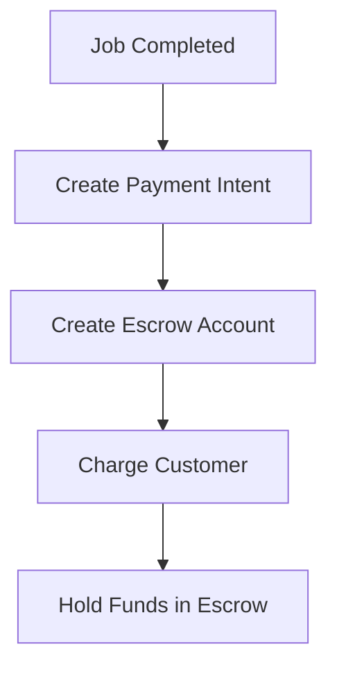
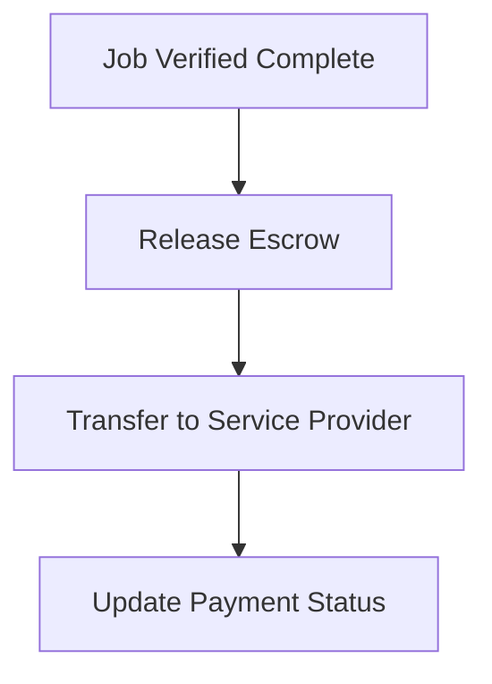
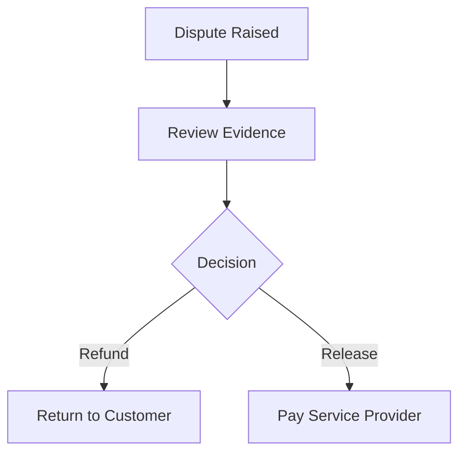

# Payment System Guide

## Overview
The BlueCollab.ai payment system provides secure payment processing for completed jobs with escrow functionality, ensuring both homeowners and service providers are protected throughout the transaction.

## Features

### 💳 Payment Processing
- **Stripe Integration**: Secure payment processing
- **Multiple Payment Methods**: Credit cards and saved payment methods
- **Mock Payment Mode**: Development-friendly testing without real charges
- **Payment History**: Complete transaction tracking

### 🛡️ Escrow System
- **Fund Protection**: Hold payments until job completion
- **Automatic Release**: Release funds when job is marked complete
- **Manual Release**: Homeowner can release funds early
- **Dispute Handling**: Built-in dispute resolution process

### 🔒 Security Features
- **PCI Compliance**: Stripe handles sensitive payment data
- **Encrypted Communication**: All payment data is encrypted
- **Fraud Protection**: Stripe's built-in fraud detection
- **Secure Storage**: Payment methods stored securely

## Payment Flow

### 1. Job Completion
1. Service provider marks job as "completed"
2. Homeowner receives notification
3. "Pay Now" button appears on job card
4. Payment modal opens with job details

### 2. Payment Processing
1. Homeowner enters payment details
2. Payment intent created with Stripe
3. Payment method confirmed
4. Funds held in escrow account
5. Payment confirmation sent

### 3. Escrow Management
1. Funds held until job completion
2. Homeowner can release funds early
3. Automatic release after completion
4. Service provider receives payment

## Configuration

### Development Mode (Mock Payments)
```javascript
// In PaymentModal.tsx
const MOCK_PAYMENT = true; // Set to false for real payments
```

**Mock Payment Features:**
- No real charges processed
- Simulates payment flow
- 2-second processing delay
- Generates mock payment records
- Perfect for testing and development

### Production Mode (Real Stripe)
```env
# Environment Variables
STRIPE_PUBLISHABLE_KEY=pk_live_your_live_key
STRIPE_SECRET_KEY=sk_live_your_live_key
VITE_STRIPE_PUBLISHABLE_KEY=pk_live_your_live_key
```

## API Endpoints

### Payment Creation
```javascript
POST /api/payments/create-payment-intent
{
  "amount": 12000, // Amount in cents
  "currency": "usd",
  "jobId": "job123",
  "bidId": "bid456",
  "customerId": "cus123"
}
```

### Escrow Management
```javascript
POST /api/payments/create-escrow-account
{
  "serviceProviderId": "sp123",
  "jobId": "job123",
  "amount": 12000
}

POST /api/payments/release-escrow
{
  "paymentId": "pay123",
  "jobId": "job123",
  "reason": "job_completed"
}
```

### Payment Status
```javascript
GET /api/payments/status/:paymentId
// Returns payment status and escrow information
```

## Testing

### Test Card Numbers
```javascript
// Success
"4242424242424242"

// Decline
"4000000000000002"

// Insufficient Funds
"4000000000009995"

// Expired Card
"4000000000000069"
```

### Test Scenarios
1. **Successful Payment**: Use test card 4242...
2. **Declined Payment**: Use test card 4000...0002
3. **Insufficient Funds**: Use test card 4000...9995
4. **Expired Card**: Use test card 4000...0069

## Escrow Workflow

### 1. Payment Creation


### 2. Fund Release


### 3. Dispute Process


## Security Considerations

### Data Protection
- **PCI DSS Compliance**: Stripe handles all sensitive data
- **Tokenization**: Payment methods stored as tokens
- **Encryption**: All data encrypted in transit and at rest
- **Access Control**: Role-based access to payment data

### Fraud Prevention
- **Stripe Radar**: Built-in fraud detection
- **Velocity Checks**: Monitor payment frequency
- **Amount Validation**: Verify payment amounts
- **User Verification**: Confirm user identity

## Error Handling

### Common Errors
```javascript
// Invalid API Key
{
  "error": "Invalid API Key provided",
  "code": "invalid_api_key"
}

// Insufficient Funds
{
  "error": "Your card has insufficient funds",
  "code": "card_declined"
}

// Expired Card
{
  "error": "Your card has expired",
  "code": "expired_card"
}
```

### Error Recovery
1. **Display User-Friendly Messages**: Convert technical errors to user-friendly text
2. **Retry Logic**: Implement retry for transient errors
3. **Fallback Options**: Provide alternative payment methods
4. **Support Contact**: Include support information for complex issues

## Monitoring and Analytics

### Payment Metrics
- **Success Rate**: Percentage of successful payments
- **Average Transaction Value**: Mean payment amount
- **Payment Method Distribution**: Cards vs other methods
- **Escrow Release Time**: Time from payment to release

### Error Tracking
- **Failed Payment Reasons**: Categorize failure causes
- **Retry Success Rate**: Track retry effectiveness
- **User Drop-off Points**: Identify where users abandon payments

## Integration Guide

### Frontend Integration
```javascript
// Payment Modal Component
import { PaymentModal } from './components/PaymentModal';

<PaymentModal
  job={selectedJob}
  bid={acceptedBid}
  isOpen={paymentModalOpen}
  onClose={() => setPaymentModalOpen(false)}
  onPaymentSuccess={handlePaymentSuccess}
/>
```

### Backend Integration
```javascript
// Payment Service
const stripe = require('stripe')(process.env.STRIPE_SECRET_KEY);

// Create payment intent
const paymentIntent = await stripe.paymentIntents.create({
  amount: amountInCents,
  currency: 'usd',
  metadata: {
    jobId: jobId,
    bidId: bidId
  }
});
```

## Troubleshooting

### Common Issues

#### Payment Not Processing
1. Check Stripe API keys
2. Verify webhook endpoints
3. Check network connectivity
4. Review error logs

#### Escrow Not Releasing
1. Verify job completion status
2. Check escrow account status
3. Review release conditions
4. Check service provider account

#### Mock Payments Not Working
1. Ensure `MOCK_PAYMENT = true`
2. Check form validation
3. Verify payment callback
4. Review console errors

## Best Practices

### For Developers
- **Test Thoroughly**: Use test cards and mock mode
- **Handle Errors Gracefully**: Provide clear error messages
- **Monitor Performance**: Track payment success rates
- **Secure Implementation**: Follow security best practices

### For Users
- **Verify Job Completion**: Ensure work is satisfactory before payment
- **Keep Records**: Save payment confirmations
- **Report Issues**: Contact support for payment problems
- **Use Secure Networks**: Avoid public WiFi for payments

## Future Enhancements

### Planned Features
- **Cryptocurrency Payments**: Bitcoin and other crypto support
- **International Payments**: Multi-currency support
- **Subscription Payments**: Recurring service payments
- **Mobile Payments**: Apple Pay and Google Pay integration
- **Advanced Escrow**: Multi-party escrow for complex projects

### API Improvements
- **Webhook Support**: Real-time payment notifications
- **Batch Processing**: Multiple payment processing
- **Advanced Analytics**: Detailed payment insights
- **Custom Integrations**: Third-party service integration
